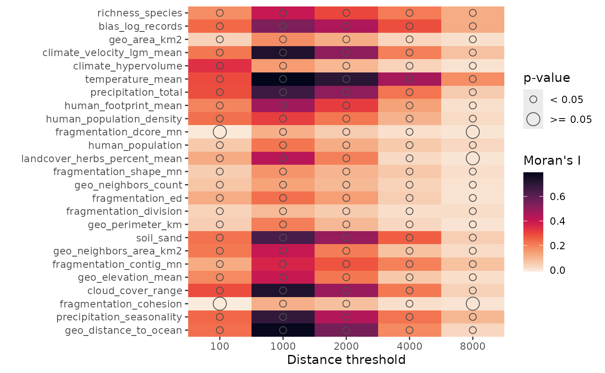
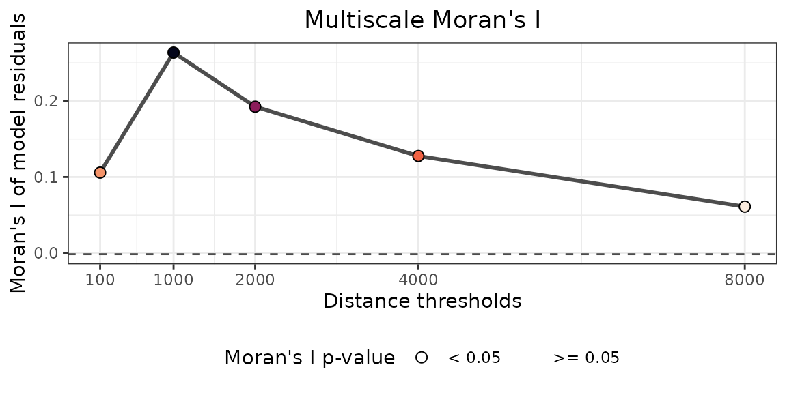
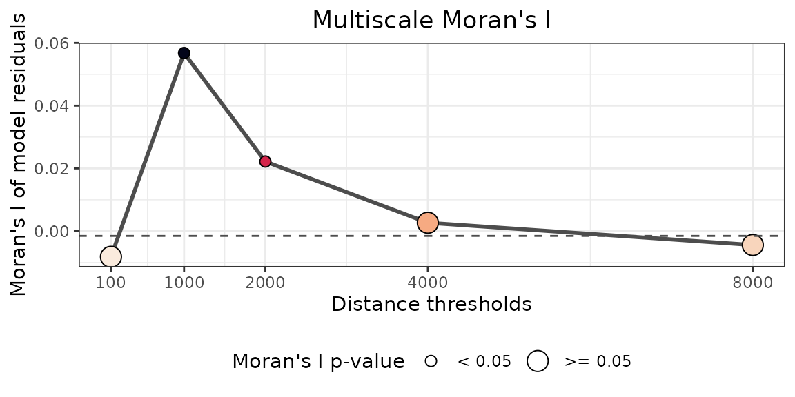
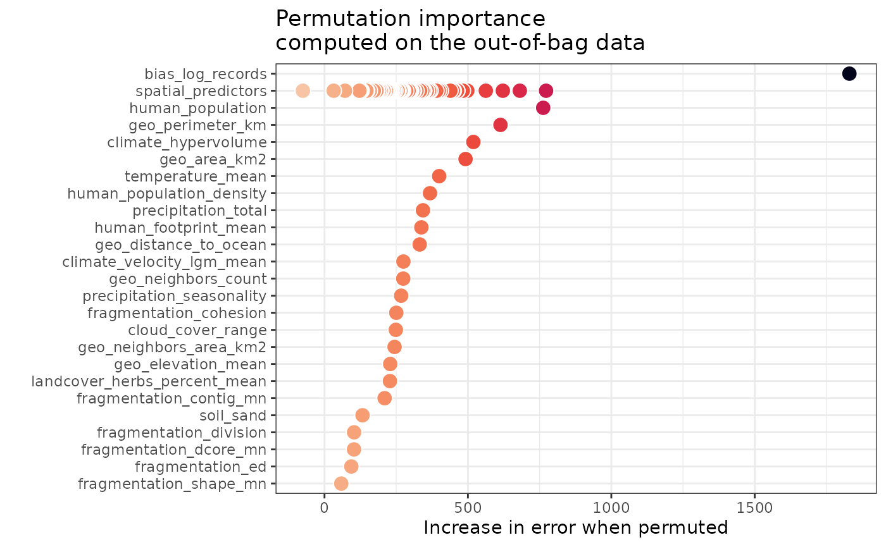
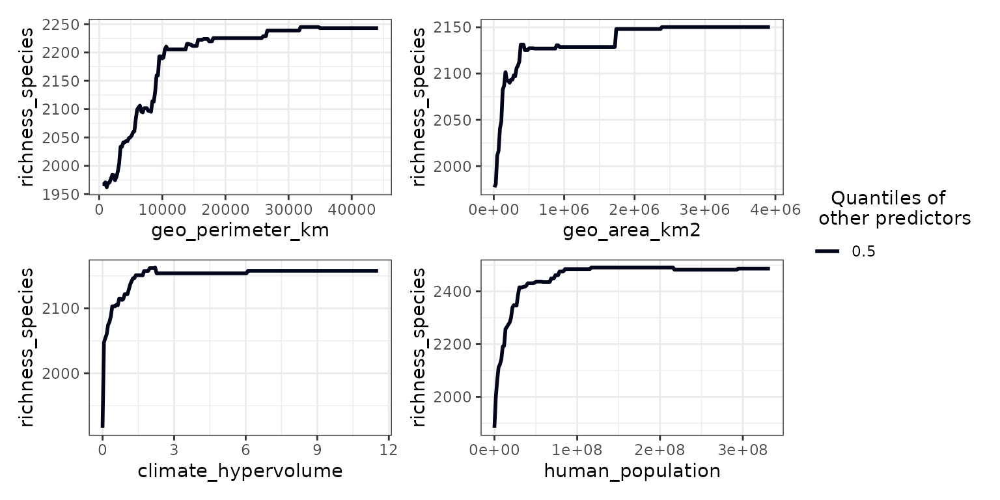

# plantae

## Overview

The `plantae` dataset contains plant diversity metrics for **662 global
ecoregions**, derived from **244M+ GBIF plant presence records** and a
large set of environmental predictors (see `plantae_predictors`).

Its main features are:

- *Complete case study*: No missing values, clean data ready for
  analysis.
- *Global scope*: All major biomes and biogeographic realms.
- *Multiple responses*: 53 response variables (see `plantae_responses`)
  covering richness, rarity, and beta diversity.
- *Large number of predictors*: The 84 predictors (see
  `plantae_predictors`) span 12 categories (temperature, precipitation,
  atmospheric, soil, fragmentation, human impact, and more).

The dataset is designed to support a wide range of ecological modeling
approaches.

## Setup

The following R libraries and example data are required to run this
tutorial.

## Description

The dataset is an `sf` data frame with 662 rows and 143 columns, and no
missing data. The first 10 records and all columns but `geometry` are
shown below.

``` r
plantae |>
  head(n = 10) |>
  dplyr::glimpse()
#> Rows: 10
#> Columns: 143
#> $ ecoregion_id                             <dbl> 473, 193, 298, 613, 99, 805, …
#> $ ecoregion_name                           <chr> "Japurá-Solimões-Negro moist …
#> $ ecoregion_biome                          <chr> "Tropical & Subtropical Moist…
#> $ ecoregion_realm                          <chr> "Neotropic", "Australasia", "…
#> $ ecoregion_continent                      <chr> "Americas", "Oceania", "Euras…
#> $ richness_species                         <int> 4835, 2197, 1336, 4360, 2271,…
#> $ richness_genera                          <int> 1231, 650, 769, 1452, 795, 14…
#> $ richness_families                        <int> 203, 132, 180, 234, 164, 201,…
#> $ richness_classes                         <int> 6, 5, 7, 6, 4, 8, 5, 6, 5, 6
#> $ richness_species_trees                   <int> 2448, 166, 436, 1364, 729, 48…
#> $ richness_genera_trees                    <int> 577, 55, 268, 552, 303, 227, …
#> $ richness_families_trees                  <int> 112, 32, 72, 120, 89, 74, 10,…
#> $ richness_species_grasses                 <int> 112, 221, 43, 286, 141, 401, …
#> $ richness_genera_grasses                  <int> 50, 67, 35, 91, 55, 123, 42, …
#> $ rarity_weighted_richness_species         <dbl> 426.27763, 269.42868, 97.6067…
#> $ rarity_weighted_richness_genera          <dbl> 30.43368, 15.10900, 10.17875,…
#> $ rarity_weighted_richness_species_trees   <dbl> 217.008423, 17.151178, 23.930…
#> $ rarity_weighted_richness_genera_trees    <dbl> 17.6373842, 1.3127927, 4.0111…
#> $ rarity_weighted_richness_species_grasses <dbl> 5.648815, 22.025660, 3.102633…
#> $ rarity_weighted_richness_genera_grasses  <dbl> 0.8883361, 1.0822623, 0.27355…
#> $ mean_rarity_species                      <dbl> 0.08816497, 0.12263481, 0.073…
#> $ mean_rarity_genera                       <dbl> 0.024722726, 0.023244614, 0.0…
#> $ mean_rarity_species_trees                <dbl> 0.08864723, 0.10332035, 0.054…
#> $ mean_rarity_genera_trees                 <dbl> 0.030567390, 0.023868958, 0.0…
#> $ mean_rarity_species_grasses              <dbl> 0.05043585, 0.09966362, 0.072…
#> $ mean_rarity_genera_grasses               <dbl> 0.017766722, 0.016153169, 0.0…
#> $ betadiversity_R_species                  <int> 9498, 11004, 1997, 19412, 854…
#> $ betadiversity_R_percent_species          <dbl> 64.86819, 83.04906, 55.41065,…
#> $ betadiversity_R_genera                   <int> 826, 1925, 641, 1884, 1005, 4…
#> $ betadiversity_R_percent_genera           <dbl> 39.57834, 74.58349, 43.39878,…
#> $ betadiversity_R_families                 <int> 51, 166, 51, 102, 98, 35, 58,…
#> $ betadiversity_R_percent_families         <dbl> 20.07874, 55.70470, 21.61017,…
#> $ betadiversity_R_species_trees            <int> 3591, 2389, 467, 4341, 2382, …
#> $ betadiversity_R_percent_species_trees    <dbl> 58.49487, 93.46635, 47.84836,…
#> $ betadiversity_R_genera_trees             <int> 328, 555, 184, 581, 298, 49, …
#> $ betadiversity_R_percent_genera_trees     <dbl> 35.96491, 90.98361, 38.41336,…
#> $ betadiversity_R_families_trees           <int> 25, 94, 34, 57, 39, 16, 27, 2…
#> $ betadiversity_R_percent_families_trees   <dbl> 18.11594, 74.60317, 32.07547,…
#> $ betadiversity_R_species_grasses          <int> 336, 744, 145, 737, 363, 331,…
#> $ betadiversity_R_percent_species_grasses  <dbl> 73.84615, 76.85950, 73.60406,…
#> $ betadiversity_R_genera_grasses           <int> 48, 133, 55, 99, 88, 38, 47, …
#> $ betadiversity_R_percent_genera_grasses   <dbl> 48.48485, 66.50000, 59.78261,…
#> $ betadiversity_sorensen_species           <dbl> 0.5277546, 0.7210027, 0.54379…
#> $ betadiversity_sorensen_genera            <dbl> 0.2694647, 0.6006202, 0.35566…
#> $ betadiversity_sorensen_families          <dbl> 0.11159737, 0.38604651, 0.148…
#> $ betadiversity_sorensen_species_trees     <dbl> 0.4470242, 0.8787211, 0.45998…
#> $ betadiversity_sorensen_genera_trees      <dbl> 0.2307692, 0.8345865, 0.33055…
#> $ betadiversity_sorensen_families_trees    <dbl> 0.10843373, 0.59493671, 0.191…
#> $ betadiversity_sorensen_species_grasses   <dbl> 0.6250000, 0.6323777, 0.70562…
#> $ betadiversity_sorensen_genera_grasses    <dbl> 0.3378378, 0.4981273, 0.47200…
#> $ betadiversity_simpson_species            <dbl> 0.06390900, 0.02230314, 0.202…
#> $ betadiversity_simpson_genera             <dbl> 0.024370431, 0.009230769, 0.0…
#> $ betadiversity_simpson_families           <dbl> 0.000000000, 0.000000000, 0.0…
#> $ betadiversity_simpson_species_trees      <dbl> 0.041275031, 0.006024096, 0.1…
#> $ betadiversity_simpson_genera_trees       <dbl> 0.012131716, 0.000000000, 0.1…
#> $ betadiversity_simpson_families_trees     <dbl> 0.008928571, 0.000000000, 0.0…
#> $ betadiversity_simpson_species_grasses    <dbl> 0.06250000, 0.01357466, 0.209…
#> $ betadiversity_simpson_genera_grasses     <dbl> 0.02000000, 0.00000000, 0.057…
#> $ bias_log_records                         <dbl> 9.881395, 12.170088, 8.815815…
#> $ geo_neighbors_count                      <int> 10, 3, 6, 13, 3, 4, 8, 4, 5, 4
#> $ geo_neighbors_area_km2                   <int> 2005112, 761733, 499488, 7202…
#> $ geo_neighbors_aridity_mean               <dbl> -0.9563798, 0.5657846, -0.273…
#> $ geo_area_km2                             <int> 268347, 11940, 81922, 24929, …
#> $ geo_polygons_count                       <int> 2, 7, 1, 43, 1, 1, 1, 6, 1, 1
#> $ geo_perimeter_km                         <int> 8567, 3563, 1987, 8303, 1623,…
#> $ geo_shared_perimeter_km                  <int> 8459, 3528, 1987, 4979, 904, …
#> $ geo_shared_perimeter_fraction            <dbl> 0.99, 0.99, 1.00, 0.60, 0.56,…
#> $ geo_distance_to_ocean                    <int> 9367, 1174, 1409, 85, 358, 50…
#> $ geo_elevation_mean                       <dbl> 86.016377, 1300.268070, 477.2…
#> $ human_population                         <int> 1897238, 2450, 46472620, 1135…
#> $ human_population_density                 <dbl> 7.0675297, 0.1987217, 567.254…
#> $ human_footprint_mean                     <dbl> 0.4305056, 2.5179189, 19.3168…
#> $ climate_velocity_lgm_mean                <dbl> 7.6806232, 0.8897423, 2.43905…
#> $ climate_hypervolume                      <dbl> 0.022396502, 0.012212734, 0.0…
#> $ landcover_bare_percent_mean              <dbl> 0.10334276, 0.28396785, 6.818…
#> $ landcover_herbs_percent_mean             <dbl> 16.22373, 28.57396, 81.62750,…
#> $ landcover_trees_percent_mean             <dbl> 80.99299, 70.83879, 11.30655,…
#> $ fragmentation_ai                         <dbl> 98.23654, 74.69482, 99.02252,…
#> $ fragmentation_area_mn                    <dbl> 3388500.00, 21289.66, 8200800…
#> $ fragmentation_ca                         <dbl> 27108000, 1234800, 8200800, 2…
#> $ fragmentation_clumpy                     <dbl> 0.9753594, 0.6897991, 0.98618…
#> $ fragmentation_cohesion                   <dbl> 99.81169, 96.55357, 99.67810,…
#> $ fragmentation_contig_mn                  <dbl> 0.3938724, 0.1382791, 0.98054…
#> $ fragmentation_core_mn                    <dbl> 3185850.000, 10000.000, 77924…
#> $ fragmentation_cpland                     <dbl> 26.7325362, 8.6536166, 27.793…
#> $ fragmentation_dcore_mn                   <dbl> 1.8750000, 0.7586207, 1.00000…
#> $ fragmentation_division                   <dbl> 0.9195281, 0.9882589, 0.91444…
#> $ fragmentation_ed                         <dbl> 0.12164884, 0.98143948, 0.096…
#> $ fragmentation_lsi                        <dbl> 5.573765, 14.812548, 2.392006…
#> $ fragmentation_mesh                       <dbl> 7672193.128, 78693.459, 23987…
#> $ fragmentation_ndca                       <int> 15, 44, 1, 122, 3, 7, 2, 6, 2…
#> $ fragmentation_nlsi                       <dbl> 42.98268, 543.03662, 33.63983…
#> $ fragmentation_np                         <int> 8, 58, 1, 126, 3, 1, 2, 6, 1,…
#> $ fragmentation_shape_mn                   <dbl> 1.801587, 1.678439, 2.392006,…
#> $ fragmentation_tca                        <dbl> 25486800, 580000, 7792400, 11…
#> $ fragmentation_te                         <dbl> 11598000, 6578000, 2692000, 1…
#> $ air_humidity_max                         <dbl> 73.55356, 66.91849, 63.06462,…
#> $ air_humidity_mean                        <dbl> 71.62155, 60.41771, 57.23757,…
#> $ air_humidity_min                         <dbl> 69.86486, 54.90084, 50.29069,…
#> $ air_humidity_range                       <dbl> 3.215996, 11.534526, 12.25825…
#> $ aridity_mean                             <dbl> 2.2031174, 1.2921102, 0.51042…
#> $ cloud_cover_max                          <dbl> 71.63208, 53.53228, 70.77399,…
#> $ cloud_cover_mean                         <dbl> 57.23377, 39.98402, 42.42303,…
#> $ cloud_cover_min                          <dbl> 40.902202, 29.684742, 14.4396…
#> $ cloud_cover_range                        <dbl> 30.21841, 23.36135, 55.84739,…
#> $ evapotranspiration_max                   <dbl> 135.4485, 155.6613, 185.5662,…
#> $ evapotranspiration_mean                  <dbl> 114.07073, 83.18569, 151.0150…
#> $ evapotranspiration_min                   <dbl> 91.826448, 25.519873, 116.057…
#> $ evapotranspiration_range                 <dbl> 43.12295, 129.64771, 69.01481…
#> $ precipitation_seasonality                <dbl> 27.33326, 22.15575, 77.16738,…
#> $ precipitation_total                      <dbl> 2953.3259, 1131.5263, 854.425…
#> $ precipitation_coldest_quarter            <dbl> 836.69665, 358.70920, 167.813…
#> $ precipitation_driest_month               <dbl> 158.361408, 61.908393, 7.3857…
#> $ precipitation_driest_quarter             <dbl> 507.18217, 200.21909, 36.5709…
#> $ precipitation_warmest_quarter            <dbl> 562.74768, 230.81961, 165.048…
#> $ precipitation_wettest_month              <dbl> 363.2224, 129.9431, 182.6952,…
#> $ precipitation_wettest_quarter            <dbl> 1015.6067, 368.3444, 438.6092…
#> $ temperature_isothermality                <dbl> 76.99648, 40.23496, 55.37760,…
#> $ temperature_mean_daily_range             <dbl> 5.816152, 8.847707, 9.680353,…
#> $ temperature_mean                         <dbl> 25.0341507, 7.4928180, 25.648…
#> $ temperature_range                        <dbl> 7.676869, 22.356158, 17.68530…
#> $ temperature_seasonality                  <dbl> 42.41023, 476.58344, 201.1696…
#> $ temperature_coldest_month                <dbl> 21.438079, -1.379348, 16.7388…
#> $ temperature_coldest_quarter              <dbl> 24.483276, 1.468820, 22.97271…
#> $ temperature_driest_quarter               <dbl> 25.293351, 10.979521, 24.8094…
#> $ temperature_warmest_month                <dbl> 29.66041, 20.53516, 34.85455,…
#> $ temperature_warmest_quarter              <dbl> 25.57681, 13.64903, 28.34105,…
#> $ temperature_wettest_quarter              <dbl> 24.788659, 3.620998, 24.89750…
#> $ soil_clay                                <dbl> 27.04603, 20.25723, 32.27310,…
#> $ soil_nitrogen                            <dbl> 1.5610697, 2.8912605, 1.19533…
#> $ soil_organic_carbon                      <dbl> 22.83940, 66.46767, 14.38392,…
#> $ soil_ph                                  <dbl> 4.328191, 5.281891, 6.858474,…
#> $ soil_sand                                <dbl> 38.61876, 55.87067, 39.68722,…
#> $ soil_silt                                <dbl> 32.98165, 22.52010, 26.68605,…
#> $ soil_temperature_max                     <dbl> 28.72042, 22.68232, 39.01643,…
#> $ soil_temperature_mean                    <dbl> 24.7056713, 9.2987020, 27.748…
#> $ soil_temperature_min                     <dbl> 20.84371617, -0.07568503, 18.…
#> $ soil_temperature_range                   <dbl> 7.340125, 22.637208, 20.05041…
#> $ ndvi_max                                 <dbl> 0.7685034, 0.6779593, 0.58250…
#> $ ndvi_mean                                <dbl> 0.6823738, 0.6013160, 0.42989…
#> $ ndvi_min                                 <dbl> 0.5827225, 0.4948931, 0.32135…
#> $ ndvi_range                               <dbl> 0.1857809, 0.1830662, 0.26115…
#> $ geometry                                 <POINT [°]> POINT (-65.45348 -0.9548852),…
```

The spatial distribution of ecoregion centroids covers all continents:

``` r
mapview::mapview(
  plantae,
  zcol = "richness_species",
  layer.name = "Species richness",
  col.regions = viridis::magma(
    n = length(unique(plantae$richness_species)), 
    direction = -1
    ),
  cex = sqrt(plantae$richness_species)/10
)
```

A version with the original ecoregion geometries instead of point
centroids can be downloaded with \[plantae_extra()\].

``` r
plantae_polygons <- spatialData::plantae_extra()

mapview::mapview(
  plantae_polygons,
  zcol = "richness_species",
  layer.name = "Species richness",
  col.regions = viridis::magma(
    n = length(unique(plantae$richness_species)), 
    direction = -1
    )
  )
```

Smaller subsets filtered by hemisphere with `richness_species` as the
only response variable are also available via \[plantae_west()\]
(Americas) and \[plantae_east()\] (Old World).

``` r
plantae_w <- spatialData::plantae_west()
nrow(plantae_w)
#> [1] 228

plantae_e <- spatialData::plantae_east()
nrow(plantae_e)
#> [1] 434
```

## Response Variables

The dataset provides **53 response variables** (see `plantae_responses`)
across 6 categories:

| Category                      | Count | Description                                                                 |
|-------------------------------|------:|-----------------------------------------------------------------------------|
| Richness                      |     9 | Species, genus, family, and class counts for all plants, trees, and grasses |
| Rarity-weighted richness      |     6 | Sum of inverse presence-record counts per taxon (Williams et al. 1996)      |
| Mean rarity                   |     6 | Mean of inverse presence-record counts per taxon                            |
| Beta diversity (raw turnover) |    16 | Absolute richness differences between ecoregion and neighbors               |
| Beta diversity (Sorensen)     |     8 | Sorensen dissimilarity (Bsor = 1 - 2a/(2a+b+c); Koleff et al. 2003)         |
| Beta diversity (Simpson)      |     8 | Simpson dissimilarity (Bsim = min(b,c)/(min(b,c)+a); Koleff et al. 2003)    |

## Predictor Variables

The dataset includes **84 predictor variables from 12 categories**.

| Category             | Count | Prefix                                                                                                   |
|----------------------|------:|----------------------------------------------------------------------------------------------------------|
| Sampling bias        |     1 | `bias_log_records`                                                                                       |
| Geographic/geometric |    10 | `geo_*`                                                                                                  |
| Human impact         |     3 | `human_*`                                                                                                |
| Climate              |    34 | `climate_*`, `precipitation_*`, `air_*`, `aridity_*`, `cloud_*`, `evapotranspiration_*`, `temperature_*` |
| Landcover            |     3 | `landcover_*`                                                                                            |
| Fragmentation        |    19 | `fragmentation_*`                                                                                        |
| Soil                 |    10 | `soil_*clay*`, `soil_temperature_*`                                                                      |
| NDVI                 |     4 | `ndvi_*`                                                                                                 |

## Example Usage

This example uses `plantae` to identify predictors driving the plant
richness of the World’s ecoregions.

- *Multicollinearity Analysis*: aims to limit redundancy in the
  predictors and focus on the most promising ones.
- *Spatial Autocorrelation Analysis*: to help understand the importance
  of the spatial structure of the data.
- *Spatial Modelling*: training of a spatial Random Forest models fitted
  with [`spatialRF`](https://blasbenito.github.io/spatialRF/).
- *Model Analysis*: to assess the relative importance of the spatial
  versus the environmental predictors, and understand how plant richness
  responds to environmental gradients.

### Multicollinearity Analysis

The `plantae` dataset has 84 predictors with varying levels of
redundancy. To manage multicollinearity in `plantae` we use
[`collinear::collinear()`](https://blasbenito.github.io/collinear/reference/collinear.html).

The function prioritizes the predictors in `preference_order` as
requested by the user, while the remaining ones are ranked by the
R-squared of univariate random forest models fitted against the
response. The predictors are then evaluated one by one for selection
following this ranking: if the variance inflation factor of the
candidate predictor against the selected predictors is lower than 2.5,
the predictor is added to the selection. Otherwise it is ignored, and
the next predictor is evaluated.

Notice how the argument `preference_order` is used below to *protect*
predictors that are known to influence plant species richness.

``` r
plantae_selection <- collinear::collinear(
  df = plantae,
  responses = "richness_species",
  predictors = plantae_predictors,
  f = collinear::f_count_rf,
  preference_order = c(
    "bias_log_records", #logarithm of the GBIF records used to compute richness
    "geo_area_km2", #ecoregion area
    "climate_velocity_lgm_mean", #climate stability since Last Glacial Maximum
    "climate_hypervolume", #relative size of the ecoregion's climate envelope
    "temperature_mean", #mean temperature
    "precipitation_total", #total rainfall
    "human_footprint_mean", #average human footprint in the ecoregion
    "human_population_density" #inhabitants per square kilometer
  ),
  max_vif = 2.5,
  quiet = TRUE
)
```

The function returns a list full of useful data, but here we focus on
the character vector with the selected predictor names.

``` r
plantae_selection$richness_species$selection
#>  [1] "bias_log_records"             "geo_area_km2"                
#>  [3] "climate_velocity_lgm_mean"    "climate_hypervolume"         
#>  [5] "temperature_mean"             "precipitation_total"         
#>  [7] "human_footprint_mean"         "human_population_density"    
#>  [9] "fragmentation_dcore_mn"       "human_population"            
#> [11] "landcover_herbs_percent_mean" "fragmentation_shape_mn"      
#> [13] "geo_neighbors_count"          "fragmentation_ed"            
#> [15] "fragmentation_division"       "geo_perimeter_km"            
#> [17] "soil_sand"                    "geo_neighbors_area_km2"      
#> [19] "fragmentation_contig_mn"      "geo_elevation_mean"          
#> [21] "cloud_cover_range"            "fragmentation_cohesion"      
#> [23] "precipitation_seasonality"    "geo_distance_to_ocean"       
#> attr(,"validated")
#> [1] TRUE
```

### Spatial Autocorrelation Analysis

The spatial autocorrelation (SAC) analysis of the response and the
selected predictors requires a distance matrix between all pairs of
ecoregions.

**Something to take in mind**: The distance between ecoregions may vary
depending on the geometry used in the computation. The distance between
neighboring ecoregions will be zero when using the polygons resulting
from
[`plantae_extra()`](https://blasbenito.github.io/spatialData/reference/plantae_extra.md),
while they will be larger than zero when using the point geometry
(ecoregion’s centroid) in
[`spatialData::plantae`](https://blasbenito.github.io/spatialData/reference/plantae.md).

The code below uses the ecoregion centroids in
[`spatialData::plantae`](https://blasbenito.github.io/spatialData/reference/plantae.md)
to compute the distance matrix in kilometers.

``` r
plantae_distance <- sf::st_distance(
  x = plantae
) |> 
  units::set_units(value = "km") |> 
  units::drop_units() |> 
  floor()

plantae_distance[1:5, 1:5]
#>       [,1]  [,2]  [,3]  [,4]  [,5]
#> [1,]     0 14610 15776  3358 12011
#> [2,] 14610     0  9068 14138  9480
#> [3,] 15776  9068     0 16377  5361
#> [4,]  3358 14138 16377     0 15220
#> [5,] 12011  9480  5361 15220     0
```

This distance matrix is required to assess the SAC of any variable in
`plantae`. The code below analyzes SAC for the response and all
predictors at once for a range of neighborhood distances.

``` r
plantae_distances_km <- c(100, 1000, 2000, 4000, 8000)

spatialRF::plot_training_df_moran(
  data = plantae,
  dependent.variable.name = "richness_species",
  predictor.variable.names = plantae_selection$richness_species$selection,
  distance.matrix = plantae_distance,
  distance.thresholds = plantae_distances_km
)
```



Notice how the autocorrelation of most predictors peaks at 1000 km, and
remains positive for most of them across the entire distance span. This
analysis suggests that the data has a strong spatial structure, and is
likely not suited for non-spatial modelling.

We can transform this intuition into a fact by training a regular random
forest model via
[`spatialRF::rf()`](https://blasbenito.github.io/spatialRF/reference/rf.html)
and assessing the spatial autocorrelation of the residuals.

``` r
plantae_rf <- spatialRF::rf(
  data = sf::st_drop_geometry(plantae),
  dependent.variable.name = "richness_species",
  predictor.variable.names = plantae_selection$richness_species$selection,
  distance.matrix = plantae_distance,
  distance.thresholds = c(100, 1000, 2000), #more about this later!
  verbose = FALSE
)
```

The model has a good performance on the out-of-bag data (RMSE = 1527.11;
R-squared = 0.69), as most random forest models do, but let’s take a
look at the SAC of the model residuals.

``` r
spatialRF::moran_multithreshold(
  x = plantae_rf$residuals$values,
  distance.matrix = plantae_distance,
  distance.thresholds = plantae_distances_km,
  verbose = FALSE
)$plot
```



The SAC of the residuals peaks at ~1000km and remains positive over long
distances, indicating that this model is missing predictors accounting
for the spatial structure of the data.

### Spatial Modelling

The function
[`spatialRF::rf_spatial()`](https://blasbenito.github.io/spatialRF/reference/rf_spatial.html)
takes the model above, adds *spatial predictors* (namely *Moran’s
Eigenvector Maps* or MEMs) to the training data. MEMs are synthetic
predictors derived from the distance matrix. Each MEM captures a
distinct spatial pattern at a different scale, from broad continental
gradients to finer regional structures. By selecting the MEMs that
reduce residual SAC the most,
[`spatialRF::rf_spatial()`](https://blasbenito.github.io/spatialRF/reference/rf_spatial.html)
captures spatial variation in plant richness that the environmental
predictors alone cannot explain. Think of biogeographic legacies,
dispersal barriers, or unknown environmental gradients.

Since we used `distance.thresholds = c(100, 1000, 2000)` in the
non-spatial model `plantae_rf`, the function
[`spatialRF::rf_spatial()`](https://blasbenito.github.io/spatialRF/reference/rf_spatial.html)
will generate and select spatial predictors for the neighborhood
distances 100, 1000, and 2000 km.

``` r
plantae_rf_spatial <- spatialRF::rf_spatial(
  model = plantae_rf,
  verbose = FALSE
)
```

The spatial model has performance very similar to the non-spatial one
(RMSE = 1512.18; R-squared = 0.7).

Now, let’s take a look at the SAC of the model residuals.

``` r
spatialRF::moran_multithreshold(
  x = plantae_rf_spatial$residuals$values,
  distance.matrix = plantae_distance,
  distance.thresholds = plantae_distances_km,
  verbose = FALSE
)$plot
```



Notice the values in the vertical axis: the SAC of the model residuals
is still significant for the distance thresholds 1000 and 2000km, but it
is an order of magnitude smaller than in the non-spatial model.

### Model Analysis

The figure below shows how model error increases when a given predictor
is randomly shuffled. Higher values indicate stronger predictive
relevance.

``` r
spatialRF::plot_importance(
  model = plantae_rf_spatial
)
```



The high importance of `bias_log_records` reflects the extent to which
ecoregions with more records tend to have higher observed richness,
independent of true biodiversity.

Once bias is taken into account, there are several `spatial_predictors`
(MEMs) with high relative importance, reflecting processes operating at
broad scales that no single environmental variable can fully capture.

Once spatial structure is considered, four predictors remain more
important than all others:

- `geo_perimeter_km` and `geo_area_km2` represent the importance of the
  ecoregion size.
- `climate_hypervolume` represents the relative size of the climate
  space in the ecoregion.
- `human_population` indicates the importance of the human factor on
  plant species richness.

The figure below shows how predicted richness changes across the range
of these predictor when all others are held at their median (quantile
0.5).

``` r
spatialRF::plot_response_curves(
  model = plantae_rf_spatial,
  variables = c(
    "geo_perimeter_km", 
    "geo_area_km2", 
    "climate_hypervolume", 
    "human_population"
    ),
  quantiles = 0.5
)
```

 In the context of
a spatial model with MEMs, these curves represent the *environmental*
component of richness after bias and spatial structure are accounted
for. This means the relationships shown reflect genuine environmental
gradients rather than geographic clustering artefacts, making them more
interpretable than those from a non-spatial model.

The spatial random forest above demonstrates one modeling approach for
`richness_species`, one of 53 response variables available in `plantae`.
The dataset supports a much wider range of ecological modeling
experiments, from rarity-weighted richness and beta diversity analyses
to spatial cross-validation and path analysis.

Have fun with it!
