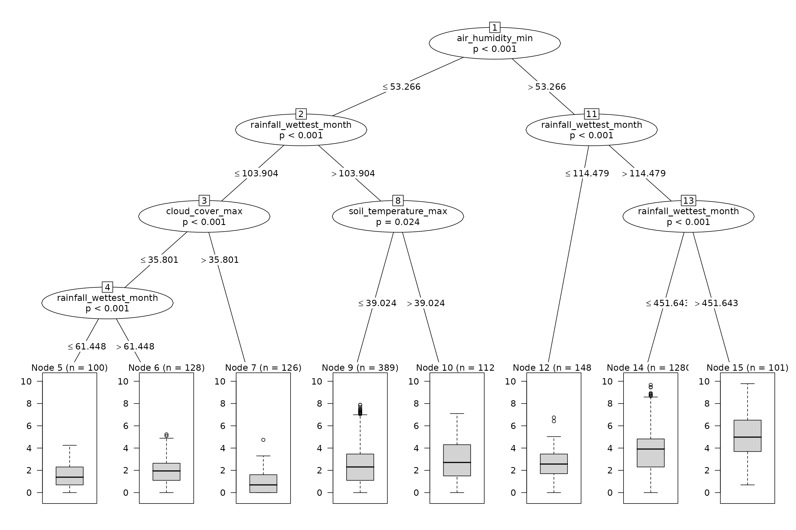

# trees

## Overview

The `trees` dataset focuses on the distribution of the tree species
present in Mesoamerica across North and South America. The presence of
Mesoamerican trees was obtained from the **Tree Biodiversity Network
(BIOTREE-NET)** dataset (project now defunct). The distribution of these
species across the Americas was derived from **GBIF**. The data
represents *richness of Mesoamerican trees in the Americas* for 3,373
hexagonal grid cells across the Americas, combined with 50 environmental
predictor variables from different sources.

Its main features are:

- *Americas scope*: Hexagonal cells covering longitudes -125.3° to
  -34.3° and latitudes -34.4° to 49.9°.
- *Single response*: `trees`, an integer count of tree species richness
  per hexagonal cell.
- *Rich environmental predictors*: 50 predictors spanning 10 categories
  (climate, soil, vegetation, geography, and more).

The dataset is designed to support regression modelling,
multicollinearity filtering, and spatial analysis of tree diversity
patterns.

## Setup

The following R libraries and example data are required to run this
tutorial.

## Description

The dataset is an `sf` data frame with 3373 rows and 53 columns, and 989
cells with `NA` in the `trees` response variable (cells where
environmental data is valid but no tree species were found in the
relevant databases). The first 10 records and all columns but `geometry`
are shown below.

``` r
trees |>
  head(n = 10) |>
  dplyr::glimpse()
#> Rows: 10
#> Columns: 53
#> $ cellid                        <int> 1, 2, 3, 4, 5, 6, 7, 8, 9, 10
#> $ trees                         <int> 1, NA, 1, 5, 1, NA, NA, NA, NA, NA
#> $ air_humidity_max              <dbl> 66.72578, 68.97865, 65.92500, 63.75984, …
#> $ air_humidity                  <dbl> 64.19672, 65.28275, 62.97762, 60.19885, …
#> $ air_humidity_min              <dbl> 62.62891, 62.51946, 59.47713, 55.22597, …
#> $ air_humidity_range            <dbl> 3.675112, 5.961699, 5.949539, 8.043704, …
#> $ aridity                       <dbl> 3.034283, 7.000583, 2.228907, 3.352518, …
#> $ cloud_cover_max               <dbl> 51.80775, 59.59544, 49.02710, 53.67749, …
#> $ cloud_cover                   <dbl> 39.38748, 49.43344, 36.08522, 37.64137, …
#> $ cloud_cover_min               <dbl> 23.980626, 37.773336, 18.689770, 14.2178…
#> $ cloud_cover_range             <dbl> 27.21311, 21.36061, 29.83153, 38.95784, …
#> $ evapotranspiration_max        <dbl> 145.8778, 121.9521, 162.0084, 165.8928, …
#> $ evapotranspiration            <dbl> 81.39344, 62.25680, 86.53583, 83.38519, …
#> $ evapotranspiration_min        <dbl> 31.34277, 18.14818, 26.22737, 24.54848, …
#> $ evapotranspiration_range      <dbl> 114.0328, 103.3089, 135.2890, 140.8501, …
#> $ rainfall_seasonality          <dbl> 69.05514, 58.10799, 83.43844, 73.72836, …
#> $ rainfall                      <dbl> 1984.803, 3788.573, 1797.700, 2674.796, …
#> $ rainfall_coldest_quarter      <dbl> 899.4158, 1485.1863, 935.7548, 1274.9368…
#> $ rainfall_driest_month         <dbl> 13.207154, 72.568857, 4.360102, 12.90247…
#> $ rainfall_driest_quarter       <dbl> 74.86140, 287.73483, 34.07716, 87.48721,…
#> $ rainfall_warmest_quarter      <dbl> 74.86140, 314.23001, 34.07716, 87.48721,…
#> $ rainfall_wettest_month        <dbl> 354.6468, 601.3340, 376.6572, 511.7660, …
#> $ rainfall_wettest_quarter      <dbl> 952.3741, 1699.2585, 954.7104, 1328.0056…
#> $ temperature_isothermality     <dbl> 42.31744, 31.10151, 46.19262, 40.70953, …
#> $ temperature_mean_daily_range  <dbl> 4.970194, 4.531185, 7.362851, 7.845559, …
#> $ temperature                   <dbl> 10.965723, 8.226245, 10.837620, 10.12197…
#> $ temperature_range             <dbl> 12.12370, 15.21725, 16.33477, 19.58319, …
#> $ temperature_seasonality       <dbl> 255.8554, 356.1905, 308.2309, 410.3759, …
#> $ temperature_coldest_month_min <dbl> 5.6348733, 1.8606111, 4.1480463, 2.53274…
#> $ temperature_coldest_quarter   <dbl> 8.016393, 4.015278, 7.217357, 5.473721, …
#> $ temperature_driest_quarter    <dbl> 14.54247, 12.75220, 15.08227, 15.84711, …
#> $ temperature_warmest_month_max <dbl> 18.26975, 17.30557, 20.92225, 22.42327, …
#> $ temperature_warmest_quarter   <dbl> 14.54247, 13.03118, 15.08227, 15.84711, …
#> $ temperature_wettest_quarter   <dbl> 8.542474, 4.589159, 7.622423, 5.954469, …
#> $ distance_to_ocean             <dbl> 47.70194, 95.32629, 160.80169, 236.81731…
#> $ elevation                     <dbl> 82.64232, 279.17706, 327.39466, 516.4347…
#> $ latitude                      <dbl> 43.07518, 48.57816, 40.58208, 42.43964, …
#> $ longitude                     <dbl> -124.3935, -124.6602, -124.0775, -124.14…
#> $ soil_clay                     <dbl> 18.97297, 19.41023, 26.68421, 28.00797, …
#> $ soil_nitrogen                 <dbl> 4.081081, 5.990067, 3.774358, 4.297677, …
#> $ soil_organic_carbon           <dbl> 69.37015, 86.66117, 72.22415, 75.67207, …
#> $ soil_ph                       <dbl> 5.242456, 4.839451, 5.537970, 5.388273, …
#> $ soil_sand                     <dbl> 49.89072, 32.86094, 28.39756, 31.97907, …
#> $ soil_silt                     <dbl> 29.78496, 46.36619, 43.56146, 38.65843, …
#> $ soil_temperature_max          <dbl> 20.68563, 19.32484, 23.68939, 24.77120, …
#> $ soil_temperature              <dbl> 10.056886, 7.044211, 11.533294, 10.98734…
#> $ soil_temperature_min          <dbl> 1.9985030, -0.7671579, 2.9644339, 1.4102…
#> $ soil_temperature_range        <dbl> 18.21407, 20.42632, 20.22940, 22.93742, …
#> $ ndvi_max                      <dbl> 0.7350104, 0.8117852, 0.7702507, 0.77888…
#> $ ndvi                          <dbl> 0.6665069, 0.7123055, 0.7063288, 0.71021…
#> $ ndvi_min                      <dbl> 0.5839046, 0.6050872, 0.6405807, 0.62898…
#> $ ndvi_range                    <dbl> 0.1511058, 0.2066980, 0.1296699, 0.14990…
#> $ geometry                      <POLYGON [°]> POLYGON ((-124.8289 42.6689..., POLYGON …
```

The hexagonal grid cells cover the Americas between approximately 50°N
and 35°S. The map below shows the grid coloured by tree richness.

``` r
mapview::mapview(
  trees,
  zcol = "trees",
  layer.name = "trees",
  col.regions = viridis::turbo(
    n = 100,
    direction = 1
  ),
  color = NULL,
  at = c(1, 10, 100, 1000, 10000, 20000)
)
```

## Response Variable

The response variable `trees` (named in the vector `trees_response`) is
an **integer count** of tree species richness per hexagonal cell,
derived from GBIF and BIOTREE-NET occurrence records acquired *circa*
2013.

``` r
summary(trees$trees)
#>    Min. 1st Qu.  Median    Mean 3rd Qu.    Max.    NA's 
#>     1.0     5.0    21.0   219.5    89.0 17756.0     989
```

The dataset includes **50 numeric predictors**, named in the vector
`trees_predictors`.

``` r
trees |> 
  sf::st_drop_geometry() |> 
  dplyr::select(
    dplyr::all_of(trees_predictors)
  ) |> 
  head(n = 5) |> 
  dplyr::glimpse()
#> Rows: 5
#> Columns: 50
#> $ air_humidity_max              <dbl> 66.72578, 68.97865, 65.92500, 63.75984, …
#> $ air_humidity                  <dbl> 64.19672, 65.28275, 62.97762, 60.19885, …
#> $ air_humidity_min              <dbl> 62.62891, 62.51946, 59.47713, 55.22597, …
#> $ air_humidity_range            <dbl> 3.675112, 5.961699, 5.949539, 8.043704, …
#> $ aridity                       <dbl> 3.034283, 7.000583, 2.228907, 3.352518, …
#> $ cloud_cover_max               <dbl> 51.80775, 59.59544, 49.02710, 53.67749, …
#> $ cloud_cover                   <dbl> 39.38748, 49.43344, 36.08522, 37.64137, …
#> $ cloud_cover_min               <dbl> 23.98063, 37.77334, 18.68977, 14.21782, …
#> $ cloud_cover_range             <dbl> 27.21311, 21.36061, 29.83153, 38.95784, …
#> $ evapotranspiration_max        <dbl> 145.8778, 121.9521, 162.0084, 165.8928, …
#> $ evapotranspiration            <dbl> 81.39344, 62.25680, 86.53583, 83.38519, …
#> $ evapotranspiration_min        <dbl> 31.34277, 18.14818, 26.22737, 24.54848, …
#> $ evapotranspiration_range      <dbl> 114.0328, 103.3089, 135.2890, 140.8501, …
#> $ rainfall_seasonality          <dbl> 69.05514, 58.10799, 83.43844, 73.72836, …
#> $ rainfall                      <dbl> 1984.803, 3788.573, 1797.700, 2674.796, …
#> $ rainfall_coldest_quarter      <dbl> 899.4158, 1485.1863, 935.7548, 1274.9368…
#> $ rainfall_driest_month         <dbl> 13.207154, 72.568857, 4.360102, 12.90247…
#> $ rainfall_driest_quarter       <dbl> 74.86140, 287.73483, 34.07716, 87.48721,…
#> $ rainfall_warmest_quarter      <dbl> 74.86140, 314.23001, 34.07716, 87.48721,…
#> $ rainfall_wettest_month        <dbl> 354.6468, 601.3340, 376.6572, 511.7660, …
#> $ rainfall_wettest_quarter      <dbl> 952.3741, 1699.2585, 954.7104, 1328.0056…
#> $ temperature_isothermality     <dbl> 42.31744, 31.10151, 46.19262, 40.70953, …
#> $ temperature_mean_daily_range  <dbl> 4.970194, 4.531185, 7.362851, 7.845559, …
#> $ temperature                   <dbl> 10.965723, 8.226245, 10.837620, 10.12197…
#> $ temperature_range             <dbl> 12.12370, 15.21725, 16.33477, 19.58319, …
#> $ temperature_seasonality       <dbl> 255.8554, 356.1905, 308.2309, 410.3759, …
#> $ temperature_coldest_month_min <dbl> 5.634873, 1.860611, 4.148046, 2.532743, …
#> $ temperature_coldest_quarter   <dbl> 8.016393, 4.015278, 7.217357, 5.473721, …
#> $ temperature_driest_quarter    <dbl> 14.54247, 12.75220, 15.08227, 15.84711, …
#> $ temperature_warmest_month_max <dbl> 18.26975, 17.30557, 20.92225, 22.42327, …
#> $ temperature_warmest_quarter   <dbl> 14.54247, 13.03118, 15.08227, 15.84711, …
#> $ temperature_wettest_quarter   <dbl> 8.542474, 4.589159, 7.622423, 5.954469, …
#> $ distance_to_ocean             <dbl> 47.70194, 95.32629, 160.80169, 236.81731…
#> $ elevation                     <dbl> 82.64232, 279.17706, 327.39466, 516.4347…
#> $ latitude                      <dbl> 43.07518, 48.57816, 40.58208, 42.43964, …
#> $ longitude                     <dbl> -124.3935, -124.6602, -124.0775, -124.14…
#> $ soil_clay                     <dbl> 18.97297, 19.41023, 26.68421, 28.00797, …
#> $ soil_nitrogen                 <dbl> 4.081081, 5.990067, 3.774358, 4.297677, …
#> $ soil_organic_carbon           <dbl> 69.37015, 86.66117, 72.22415, 75.67207, …
#> $ soil_ph                       <dbl> 5.242456, 4.839451, 5.537970, 5.388273, …
#> $ soil_sand                     <dbl> 49.89072, 32.86094, 28.39756, 31.97907, …
#> $ soil_silt                     <dbl> 29.78496, 46.36619, 43.56146, 38.65843, …
#> $ soil_temperature_max          <dbl> 20.68563, 19.32484, 23.68939, 24.77120, …
#> $ soil_temperature              <dbl> 10.056886, 7.044211, 11.533294, 10.98734…
#> $ soil_temperature_min          <dbl> 1.9985030, -0.7671579, 2.9644339, 1.4102…
#> $ soil_temperature_range        <dbl> 18.21407, 20.42632, 20.22940, 22.93742, …
#> $ ndvi_max                      <dbl> 0.7350104, 0.8117852, 0.7702507, 0.77888…
#> $ ndvi                          <dbl> 0.6665069, 0.7123055, 0.7063288, 0.71021…
#> $ ndvi_min                      <dbl> 0.5839046, 0.6050872, 0.6405807, 0.62898…
#> $ ndvi_range                    <dbl> 0.1511058, 0.2066980, 0.1296699, 0.14990…
```

## Example Usage

This example uses `trees` to assess how extreme values in climate
variables drive tree species richness across the Americas.

- *Log Transformation*: to facilitate the visualization of model
  results.
- *Variable Selection*: multicollinearity analysis of the selected
  environmental variables.
- *Conditional Inference Trees*: fits a permutation-based tree model to
  explain tree richness patterns.
- *Prediction Map*: maps the model predictions back to the hexagonal
  grid.

### Log Transformation

Before proceeding with the variable selection, we log-transform the
response variable `trees` into a new column `log_trees` to facilitate
the visualization of model results.

Tree species richness spans several orders of magnitude across the
Americas, producing a strongly skewed distribution that makes terminal
node summaries in the conditional inference tree difficult to read.
While log-transforming count data is no longer recommended for linear
models, it has no meaningful effect on split selection in `ctree()`,
which relies on rank-based permutation tests that are invariant to
monotone transformations of the response.

``` r
trees <- trees |> 
  dplyr::mutate(
    log_trees = log(trees)
  )
```

### Variable Selection

The predictors indicating climate extreme values are identified with the
suffixes `_min` and `_max` in `trees_predictors`, with the exception of
rainfall, where `rainfall_driest_month` and `rainfall_wettest_month`
represent the monthly minimum and maximum respectively.

The code below selects these predictors, and excludes `ndvi_*`.

``` r
trees_extremes <- grep(
  pattern = "^(?!.*ndvi).*(min|max|driest_month|wettest_month)",
  x = colnames(trees),
  perl = TRUE,
  value = TRUE
)

trees_extremes
#>  [1] "air_humidity_max"              "air_humidity_min"             
#>  [3] "cloud_cover_max"               "cloud_cover_min"              
#>  [5] "evapotranspiration_max"        "evapotranspiration_min"       
#>  [7] "rainfall_driest_month"         "rainfall_wettest_month"       
#>  [9] "temperature_coldest_month_min" "temperature_warmest_month_max"
#> [11] "soil_temperature_max"          "soil_temperature_min"
```

Once the candidate pool of variables is selected, we use
[`collinear::collinear()`](https://blasbenito.github.io/collinear/reference/collinear.html)
to select a non-redundant subset by prioritizing predictors by their
predictive power for the response.

``` r
trees_selection <- collinear::collinear(
  df = trees,
  responses = "log_trees",
  predictors = trees_extremes,
  f = collinear::f_numeric_rf,
  max_vif = 2.5,
  quiet = TRUE
)
```

The selected predictors for `trees` are:

``` r
trees_selection$log_trees$selection
#> [1] "air_humidity_min"       "rainfall_wettest_month" "cloud_cover_max"       
#> [4] "soil_temperature_max"  
#> attr(,"validated")
#> [1] TRUE
```

The function also returns a linear formula ready for use, and a clean
dataframe ready for analysis.

``` r
trees_selection$log_trees$formulas$linear
#> log_trees ~ air_humidity_min + rainfall_wettest_month + cloud_cover_max + 
#>     soil_temperature_max
#> <environment: 0x5586aeaa8680>
```

### Conditional Inference Tree

A conditional inference tree provides an interpretable summary of how
the selected predictors interact to explain tree species richness. The
model is fitted with
[`partykit::ctree()`](https://cran.r-project.org/package=partykit),
which uses permutation tests to select splits without overfitting bias.

``` r
trees_model <- partykit::ctree(
  formula = trees_selection$log_trees$formulas$linear,
  data = trees |> 
    sf::st_drop_geometry() |> 
    na.omit(),
  control = partykit::ctree_control(
    minbucket = 100 #minimum cases in a terminal leaf
  )
)
```

The conditional inference tree below shows the sequence of environmental
thresholds that best explain differences in tree species richness. Each
internal node shows the splitting variable, threshold, and p-value of
the permutation test; each terminal node (leaf) shows a boxplot with the
richness values of the samples it contains.

``` r
plot(x = trees_model)
```

**Interpretation
examples**

The results of conditional inference trees are easy to interpret when
the model has a reasonable number of terminal nodes. Below I discuss the
climate conditions leading to the highest and lowest predicted richness
according to the model.

**Node 15**, at the right, has the highest predicted median richness.
The relevant climate thresholds leading to maximum tree richness are:

- Minimum air humidity higher than 53%.
- Rainfall of the wettest month higher than 115mm.
- Rainfall of the wettest month higher than 451mm.

**Node 7**, third from the left, shows the lowest predicted tree
richness, and features these climate thresholds:

- Minimum air humidity smaller than 53%.
- Rainfall of the wettest month higher than 104mm.
- Maximum cloud cover higher than 36%.

### Prediction Map

Assigning predictions back to the spatial data reveals the ability of
this simple model to capture a relevant pattern of geographic variation
in tree richness. Notice that the prediction of
[`partykit::ctree()`](https://rdrr.io/pkg/partykit/man/ctree.html) can
be expressed as a quantile of the cases within each terminal node. Below
we show the prediction for the quantile 0.75.

``` r
trees$predicted <- predict(
  object = trees_model,
  newdata = sf::st_drop_geometry(trees),
  type = "quantile",
  at = 0.75 #prediction at quantile 0.75
) |> 
  exp() |> #convert log(trees) to natural range
  as.integer() |> 
  as.factor()

mapview::mapview(
  trees,
  zcol = "predicted",
  layer.name = "Predicted richness",
    col.regions = viridis::turbo(
    n = 8,
    direction = 1
  ),
  color = NULL
)
```

## Conclusion

The `trees` dataset provides a rich testbed for spatial modelling of
biodiversity patterns across the Americas. The workflow above
demonstrates how a handful of environmental predictors can produce an
interpretable regression tree capturing main geographic gradients in
tree species richness, making `trees` well suited for tutorials on
variable selection, regression modelling, and spatial visualisation in
R.
