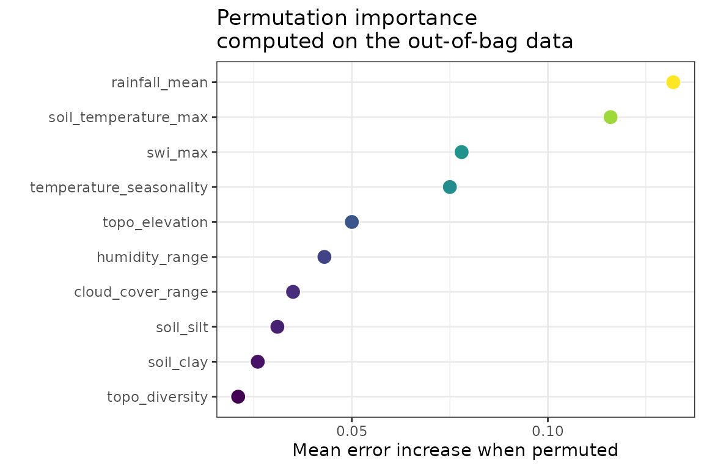
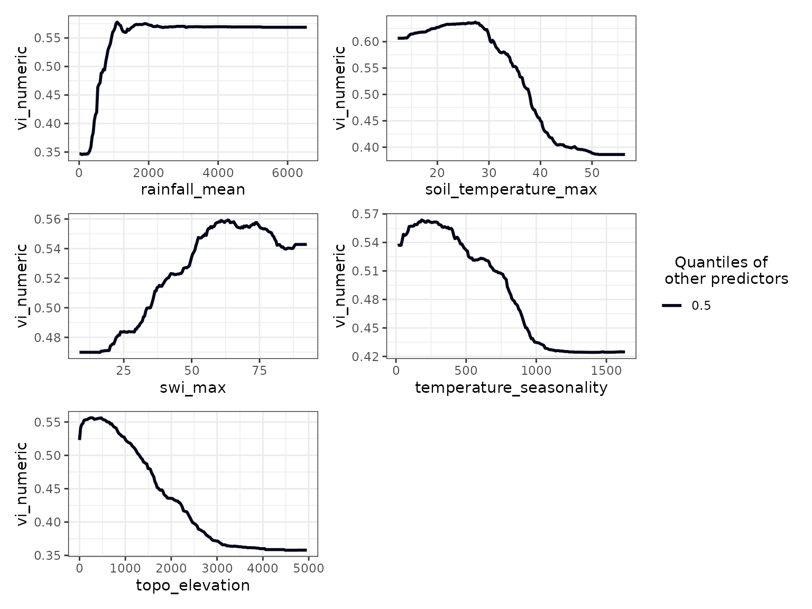
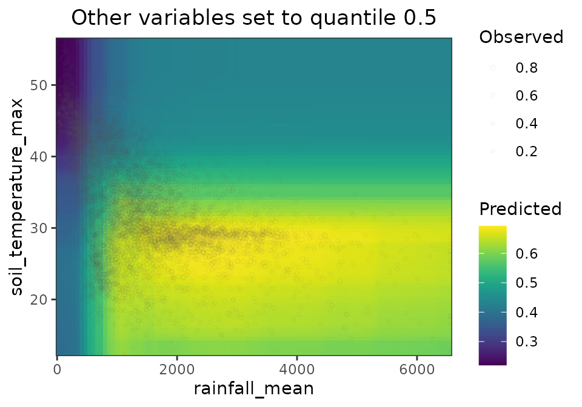

# vi

## Overview

The `vi` dataset contains ~10k records of Normalized Difference
Vegetation Index (NDVI) with different encodings (see `vi_responses`)
and a large set of numeric and categorical predictors (see
`vi_predictors`) with consistent naming patterns (e.g., `temperature_*`,
`rainfall_*`, `swi_*`).

Its main features are:

- *Complete case study* - No missing values, clean data ready for
  analysis.
- *Global scope* - 6 continents, all major climate zones, 12 biomes.
- *Grouped/stratified analysis* - Multiple hierarchical groupings
  available.

This dataset has several versions of the same response (see
\[vi_responses\]) to support a wide range of analytical approaches:
linear, count and ordinal regression, binary and multiclass
classification, and mixed-effects models.

It’s large number of predictors allows testing dimensionality reduction
and multicollinearity filtering methods, while it’s dense point cloud
helps test thinning, interpolation, spatial cross-validation, and
spatial autocorrelation analyses.

## Setup

The following R libraries are required to run this tutorial:

The code below loads the example data.

``` r
data(
  vi,
  vi_responses,
  vi_predictors,
  package = "spatialData"
  )
```

If you wish to work with a larger version (~30k) records of `vi`, you
can download it with \[vi_extra()\].

``` r
vi <- spatialData::vi_extra()
```

## Data Structure

The dataset is an `sf` data frame with 9265 rows and 64 columns, and no
missing data. The first 10 records and all columns but `geometry` are
shown below.

``` r
vi |>
  sf::st_drop_geometry() |>
  head(n = 10) |>
  dplyr::glimpse()
#> Rows: 10
#> Columns: 63
#> $ vi_numeric                 <dbl> 0.38, 0.53, 0.45, 0.69, 0.42, 0.68, 0.70, 0…
#> $ vi_counts                  <int> 380, 530, 450, 690, 420, 680, 700, 260, 550…
#> $ vi_binomial                <int> 0, 1, 0, 1, 0, 1, 1, 0, 1, 1
#> $ vi_categorical             <chr> "medium", "high", "medium", "very_high", "m…
#> $ vi_factor                  <fct> medium, high, medium, very_high, medium, ve…
#> $ koppen_zone                <chr> "BSk", "Cfa", "Dfc", "Cfb", "Aw", "Cfa", "A…
#> $ koppen_group               <chr> "Arid", "Temperate", "Cold", "Temperate", "…
#> $ koppen_description         <chr> "steppe, cold", "no dry season, hot summer"…
#> $ soil_type                  <fct> Cambisols, Acrisols, Luvisols, Alisols, Gle…
#> $ topo_slope                 <int> 6, 2, 0, 10, 0, 10, 6, 0, 2, 1
#> $ topo_diversity             <int> 29, 24, 21, 25, 19, 30, 26, 20, 26, 25
#> $ topo_elevation             <int> 1821, 143, 765, 1474, 378, 485, 604, 1159, …
#> $ swi_mean                   <dbl> 27.5, 56.1, 41.4, 59.3, 37.4, 56.3, 52.3, 2…
#> $ swi_max                    <dbl> 62.9, 74.4, 81.9, 81.1, 83.2, 73.8, 55.8, 3…
#> $ swi_min                    <dbl> 24.5, 33.3, 42.2, 31.3, 8.3, 28.8, 25.3, 11…
#> $ swi_range                  <dbl> 38.4, 41.2, 39.7, 49.8, 74.9, 45.0, 30.5, 2…
#> $ soil_temperature_mean      <dbl> 4.8, 19.9, 1.2, 13.0, 28.2, 18.1, 21.5, 23.…
#> $ soil_temperature_max       <dbl> 29.9, 32.6, 20.4, 24.6, 41.6, 29.1, 26.4, 4…
#> $ soil_temperature_min       <dbl> -12.4, 3.9, -16.0, -0.4, 16.8, 4.1, 17.3, 5…
#> $ soil_temperature_range     <dbl> 42.3, 28.8, 36.4, 25.0, 24.8, 24.9, 9.1, 38…
#> $ soil_sand                  <int> 41, 39, 27, 29, 48, 33, 30, 78, 23, 51
#> $ soil_clay                  <int> 20, 24, 28, 31, 27, 29, 40, 15, 26, 24
#> $ soil_silt                  <int> 38, 35, 43, 38, 23, 36, 29, 6, 49, 24
#> $ soil_ph                    <dbl> 6.5, 5.9, 5.6, 5.5, 6.5, 5.8, 5.2, 7.1, 7.3…
#> $ soil_soc                   <dbl> 43.1, 14.6, 36.4, 34.9, 8.1, 20.8, 44.5, 4.…
#> $ soil_nitrogen              <dbl> 2.8, 1.3, 2.9, 3.6, 1.2, 1.9, 2.8, 0.6, 3.1…
#> $ solar_rad_mean             <dbl> 17.634, 19.198, 13.257, 14.163, 24.512, 17.…
#> $ solar_rad_max              <dbl> 31.317, 24.498, 25.283, 17.237, 28.038, 22.…
#> $ solar_rad_min              <dbl> 5.209, 13.311, 1.587, 9.642, 19.102, 12.196…
#> $ solar_rad_range            <dbl> 26.108, 11.187, 23.696, 7.595, 8.936, 10.20…
#> $ growing_season_length      <dbl> 139, 365, 164, 333, 228, 365, 365, 60, 365,…
#> $ growing_season_temperature <dbl> 12.65, 19.35, 11.55, 12.45, 26.45, 17.75, 2…
#> $ growing_season_rainfall    <dbl> 224.5, 1493.4, 345.4, 1765.5, 984.4, 1860.5…
#> $ growing_degree_days        <dbl> 2140.5, 7080.9, 2053.2, 4162.9, 10036.7, 64…
#> $ temperature_mean           <dbl> 3.65, 19.35, 1.45, 11.35, 27.55, 17.65, 22.…
#> $ temperature_max            <dbl> 24.65, 33.35, 21.15, 23.75, 38.35, 30.55, 2…
#> $ temperature_min            <dbl> -14.05, 3.05, -18.25, -3.55, 19.15, 2.45, 1…
#> $ temperature_range          <dbl> 38.7, 30.3, 39.4, 27.3, 19.2, 28.1, 7.0, 29…
#> $ temperature_seasonality    <dbl> 882.6, 786.6, 1070.9, 724.7, 219.3, 747.2, …
#> $ rainfall_mean              <int> 446, 1493, 560, 1794, 990, 1860, 3150, 356,…
#> $ rainfall_min               <int> 25, 37, 24, 29, 0, 60, 122, 1, 10, 0
#> $ rainfall_max               <int> 62, 209, 87, 293, 226, 275, 425, 62, 256, 1…
#> $ rainfall_range             <int> 37, 172, 63, 264, 226, 215, 303, 61, 245, 1…
#> $ evapotranspiration_mean    <dbl> 78.32, 105.88, 50.03, 64.65, 156.60, 108.50…
#> $ evapotranspiration_max     <dbl> 164.70, 190.86, 117.53, 115.79, 187.71, 191…
#> $ evapotranspiration_min     <dbl> 13.67, 50.44, 3.53, 28.01, 128.59, 51.39, 8…
#> $ evapotranspiration_range   <dbl> 151.03, 140.42, 113.99, 87.79, 59.13, 139.9…
#> $ cloud_cover_mean           <int> 31, 48, 42, 64, 38, 52, 60, 13, 53, 32
#> $ cloud_cover_max            <int> 39, 61, 49, 71, 58, 67, 77, 18, 60, 51
#> $ cloud_cover_min            <int> 16, 34, 33, 54, 19, 39, 45, 6, 45, 14
#> $ cloud_cover_range          <int> 23, 27, 15, 17, 38, 27, 32, 11, 15, 37
#> $ aridity_index              <dbl> 0.54, 1.27, 0.90, 2.08, 0.55, 1.67, 2.88, 0…
#> $ humidity_mean              <dbl> 55.56, 62.14, 59.87, 69.32, 51.60, 62.76, 7…
#> $ humidity_max               <dbl> 63.98, 65.00, 68.19, 71.90, 67.07, 65.68, 7…
#> $ humidity_min               <dbl> 48.41, 58.97, 53.75, 67.21, 33.89, 59.92, 7…
#> $ humidity_range             <dbl> 15.57, 6.03, 14.44, 4.69, 33.18, 5.76, 3.99…
#> $ biogeo_ecoregion           <chr> "South Central Rockies forests", "Jian Nan …
#> $ biogeo_biome               <chr> "Temperate Conifer Forests", "Tropical & Su…
#> $ biogeo_realm               <chr> "Nearctic", "Indomalayan", "Nearctic", "Pal…
#> $ country_name               <chr> "United States of America", "China", "Canad…
#> $ continent                  <chr> "North America", "Asia", "North America", "…
#> $ region                     <chr> "Americas", "Asia", "Americas", "Asia", "Af…
#> $ subregion                  <chr> "Northern America", "Eastern Asia", "Northe…
```

The spatial distribution of the data is irregular, and excludes regions
with little to no vegetation activity (`vi$vi_numeric > 0`).

``` r
mapview::mapview(
  vi,
  zcol = "vi_numeric",
  layer.name = "vi"
)
```

## Response Variables

The dataset provides **5 different encodings** (see `vi_responses`) of
the same underlying vegetation index, enabling different modeling
approaches:

| Variable         | Type             | Description                        | Use Case                             |
|------------------|------------------|------------------------------------|--------------------------------------|
| `vi_numeric`     | Continuous (0-1) | Raw NDVI values                    | Linear regression, GAM               |
| `vi_counts`      | Integer          | `vi_numeric * 1000` as integer     | Poisson/negative binomial regression |
| `vi_binomial`    | Binary (0/1)     | Thresholded to 0 or 1              | Logistic regression, classification  |
| `vi_categorical` | Character        | 5 categories based on quantiles    | Multinomial models                   |
| `vi_factor`      | Factor           | `vi_categorical` as ordered factor | Ordinal regression                   |

## Predictor Variables

The dataset includes **58 predictor variables from 11 datasources**, of
which 47 are numeric and 11 are categorical.

``` r
vi |> 
  sf::st_drop_geometry() |> 
  dplyr::select(
    dplyr::all_of(vi_predictors)
  ) |> 
  head(n = 5) |> 
  dplyr::glimpse()
#> Rows: 5
#> Columns: 58
#> $ koppen_zone                <chr> "BSk", "Cfa", "Dfc", "Cfb", "Aw"
#> $ koppen_group               <chr> "Arid", "Temperate", "Cold", "Temperate", "…
#> $ koppen_description         <chr> "steppe, cold", "no dry season, hot summer"…
#> $ soil_type                  <fct> Cambisols, Acrisols, Luvisols, Alisols, Gle…
#> $ topo_slope                 <int> 6, 2, 0, 10, 0
#> $ topo_diversity             <int> 29, 24, 21, 25, 19
#> $ topo_elevation             <int> 1821, 143, 765, 1474, 378
#> $ swi_mean                   <dbl> 27.5, 56.1, 41.4, 59.3, 37.4
#> $ swi_max                    <dbl> 62.9, 74.4, 81.9, 81.1, 83.2
#> $ swi_min                    <dbl> 24.5, 33.3, 42.2, 31.3, 8.3
#> $ swi_range                  <dbl> 38.4, 41.2, 39.7, 49.8, 74.9
#> $ soil_temperature_mean      <dbl> 4.8, 19.9, 1.2, 13.0, 28.2
#> $ soil_temperature_max       <dbl> 29.9, 32.6, 20.4, 24.6, 41.6
#> $ soil_temperature_min       <dbl> -12.4, 3.9, -16.0, -0.4, 16.8
#> $ soil_temperature_range     <dbl> 42.3, 28.8, 36.4, 25.0, 24.8
#> $ soil_sand                  <int> 41, 39, 27, 29, 48
#> $ soil_clay                  <int> 20, 24, 28, 31, 27
#> $ soil_silt                  <int> 38, 35, 43, 38, 23
#> $ soil_ph                    <dbl> 6.5, 5.9, 5.6, 5.5, 6.5
#> $ soil_soc                   <dbl> 43.1, 14.6, 36.4, 34.9, 8.1
#> $ soil_nitrogen              <dbl> 2.8, 1.3, 2.9, 3.6, 1.2
#> $ solar_rad_mean             <dbl> 17.634, 19.198, 13.257, 14.163, 24.512
#> $ solar_rad_max              <dbl> 31.317, 24.498, 25.283, 17.237, 28.038
#> $ solar_rad_min              <dbl> 5.209, 13.311, 1.587, 9.642, 19.102
#> $ solar_rad_range            <dbl> 26.108, 11.187, 23.696, 7.595, 8.936
#> $ growing_season_length      <dbl> 139, 365, 164, 333, 228
#> $ growing_season_temperature <dbl> 12.65, 19.35, 11.55, 12.45, 26.45
#> $ growing_season_rainfall    <dbl> 224.5, 1493.4, 345.4, 1765.5, 984.4
#> $ growing_degree_days        <dbl> 2140.5, 7080.9, 2053.2, 4162.9, 10036.7
#> $ temperature_mean           <dbl> 3.65, 19.35, 1.45, 11.35, 27.55
#> $ temperature_max            <dbl> 24.65, 33.35, 21.15, 23.75, 38.35
#> $ temperature_min            <dbl> -14.05, 3.05, -18.25, -3.55, 19.15
#> $ temperature_range          <dbl> 38.7, 30.3, 39.4, 27.3, 19.2
#> $ temperature_seasonality    <dbl> 882.6, 786.6, 1070.9, 724.7, 219.3
#> $ rainfall_mean              <int> 446, 1493, 560, 1794, 990
#> $ rainfall_min               <int> 25, 37, 24, 29, 0
#> $ rainfall_max               <int> 62, 209, 87, 293, 226
#> $ rainfall_range             <int> 37, 172, 63, 264, 226
#> $ evapotranspiration_mean    <dbl> 78.32, 105.88, 50.03, 64.65, 156.60
#> $ evapotranspiration_max     <dbl> 164.70, 190.86, 117.53, 115.79, 187.71
#> $ evapotranspiration_min     <dbl> 13.67, 50.44, 3.53, 28.01, 128.59
#> $ evapotranspiration_range   <dbl> 151.03, 140.42, 113.99, 87.79, 59.13
#> $ cloud_cover_mean           <int> 31, 48, 42, 64, 38
#> $ cloud_cover_max            <int> 39, 61, 49, 71, 58
#> $ cloud_cover_min            <int> 16, 34, 33, 54, 19
#> $ cloud_cover_range          <int> 23, 27, 15, 17, 38
#> $ aridity_index              <dbl> 0.54, 1.27, 0.90, 2.08, 0.55
#> $ humidity_mean              <dbl> 55.56, 62.14, 59.87, 69.32, 51.60
#> $ humidity_max               <dbl> 63.98, 65.00, 68.19, 71.90, 67.07
#> $ humidity_min               <dbl> 48.41, 58.97, 53.75, 67.21, 33.89
#> $ humidity_range             <dbl> 15.57, 6.03, 14.44, 4.69, 33.18
#> $ biogeo_ecoregion           <chr> "South Central Rockies forests", "Jian Nan …
#> $ biogeo_biome               <chr> "Temperate Conifer Forests", "Tropical & Su…
#> $ biogeo_realm               <chr> "Nearctic", "Indomalayan", "Nearctic", "Pal…
#> $ country_name               <chr> "United States of America", "China", "Canad…
#> $ continent                  <chr> "North America", "Asia", "North America", "…
#> $ region                     <chr> "Americas", "Asia", "Americas", "Asia", "Af…
#> $ subregion                  <chr> "Northern America", "Eastern Asia", "Northe…
```

## Example Usage

This brief example shows how `vi` can be used to train a random forest
model.

### Selection of Numeric Predictors

The `vi_predictors` vector contains both numeric and categorical
variables. In this example we focus on the numeric ones, which can be
extracted using
[`collinear::identify_numeric_variables()`](https://blasbenito.github.io/collinear/reference/identify_numeric_variables.html).

``` r
vi_predictors_numeric <- collinear::identify_numeric_variables(
    df = sf::st_drop_geometry(vi),
    predictors = vi_predictors
  )$valid

vi_predictors_numeric
#>  [1] "topo_slope"                 "topo_diversity"            
#>  [3] "topo_elevation"             "swi_mean"                  
#>  [5] "swi_max"                    "swi_min"                   
#>  [7] "swi_range"                  "soil_temperature_mean"     
#>  [9] "soil_temperature_max"       "soil_temperature_min"      
#> [11] "soil_temperature_range"     "soil_sand"                 
#> [13] "soil_clay"                  "soil_silt"                 
#> [15] "soil_ph"                    "soil_soc"                  
#> [17] "soil_nitrogen"              "solar_rad_mean"            
#> [19] "solar_rad_max"              "solar_rad_min"             
#> [21] "solar_rad_range"            "growing_season_length"     
#> [23] "growing_season_temperature" "growing_season_rainfall"   
#> [25] "growing_degree_days"        "temperature_mean"          
#> [27] "temperature_max"            "temperature_min"           
#> [29] "temperature_range"          "temperature_seasonality"   
#> [31] "rainfall_mean"              "rainfall_min"              
#> [33] "rainfall_max"               "rainfall_range"            
#> [35] "evapotranspiration_mean"    "evapotranspiration_max"    
#> [37] "evapotranspiration_min"     "evapotranspiration_range"  
#> [39] "cloud_cover_mean"           "cloud_cover_max"           
#> [41] "cloud_cover_min"            "cloud_cover_range"         
#> [43] "aridity_index"              "humidity_mean"             
#> [45] "humidity_max"               "humidity_min"              
#> [47] "humidity_range"
```

### Multicollinearity Filtering

Many predictors in this dataset are highly correlated (e.g.,
`temperature_mean`, `temperature_max`, `temperature_min`). The
[`collinear::collinear()`](https://blasbenito.github.io/collinear/reference/collinear.html)
function from the R package
[`collinear`](https://blasbenito.github.io/collinear/) selects a
non-redundant subset that maximizes predictive power for the response
variable.

``` r
predictors_selection <- collinear::collinear(
  df = vi,
  responses = "vi_numeric",
  predictors = vi_predictors_numeric,
  f = collinear::f_numeric_rf,
  quiet = TRUE
)

predictors_selection$vi_numeric$selection
#>  [1] "rainfall_mean"           "soil_temperature_max"   
#>  [3] "swi_max"                 "temperature_seasonality"
#>  [5] "humidity_range"          "topo_elevation"         
#>  [7] "topo_diversity"          "cloud_cover_range"      
#>  [9] "soil_clay"               "soil_silt"              
#> attr(,"validated")
#> [1] TRUE
```

### Random Forest Model

The response `vi_numeric` and the selected predictors are used below to
train a random forest model using the R package
[`spatialRF`](https://blasbenito.github.io/spatialRF/).

``` r
m <- spatialRF::rf(
  data = sf::st_drop_geometry(vi),
  dependent.variable.name = "vi_numeric",
  predictor.variable.names = predictors_selection$vi_numeric$selection,
  verbose = FALSE
)

spatialRF::print_performance(model = m)
#> 
#> Model performance 
#>   - R squared (oob):                  0.9017871
#>   - R squared (cor(obs, pred)^2):     0.9827027
#>   - Pseudo R squared (cor(obs, pred)):0.9913136
#>   - RMSE (oob):                       0.05788698
#>   - RMSE:                             0.0252
#>   - Normalized RMSE:                  0.08689655
```

### Global Variable Importance

The permutation importance plot below indicates the variables that
increase model errors the most when permuted.

``` r
spatialRF::plot_importance(
  m = m,
  fill.color = viridis::viridis(n = 100)
)
```



### Local Variable Importance

The code below assigns to each observation the name of the predictor
that matters most for that specific location’s prediction, revealing
geographic patterns in variable relevance.

``` r
local_importance <- m$importance$local
vi$most_important <- colnames(local_importance)[max.col(local_importance)]

mapview::mapview(
  vi,
  zcol = "most_important",
  layer.name = "Most important predictor",
  col.regions = viridis::turbo(n = length(unique(vi$most_important)))
)
```

### Response Curves and Surfaces

The response curves below show how the response `vi_numeric` changes
across the values of the most important predictors when all other
predictors are set to their quantile 0.5.

``` r
spatialRF::plot_response_curves(
  model = m,
  quantiles = 0.5
)
```



Finally, the response surface below shows how `rainfall_mean` and
`soil_temperature_max` interact with each other to predict `vi_numeric`.
The grey dots represent the actual observations of `vi_numeric`.

``` r
spatialRF::plot_response_surface(
  m = m,
  a = "rainfall_mean",
  b = "soil_temperature_max",
  fill.color = viridis::viridis(n = 100),
  point.alpha = 0.05,
  point.size.range = c(0.05, 1)
)
```



The usage example above is only one of the many modeling approaches that
can be applied to `vi`. Have fun with it!
